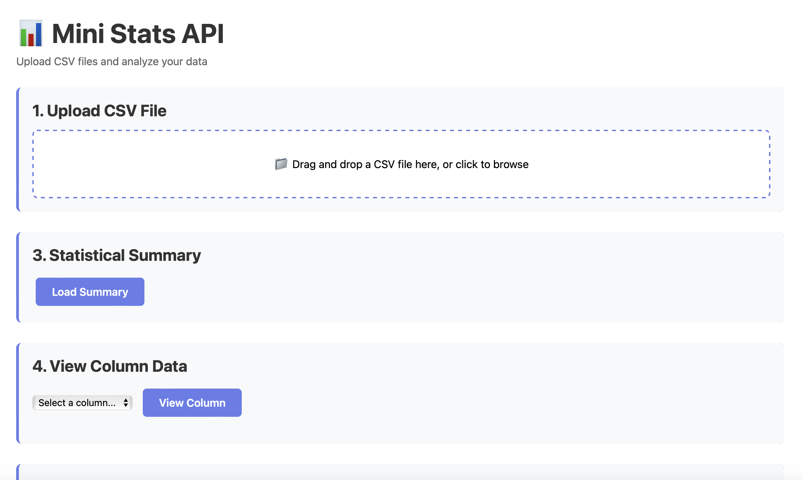
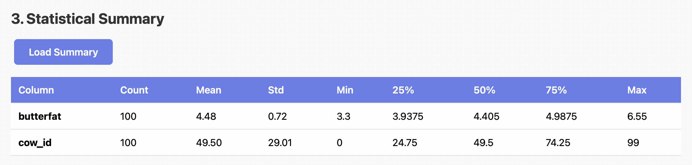
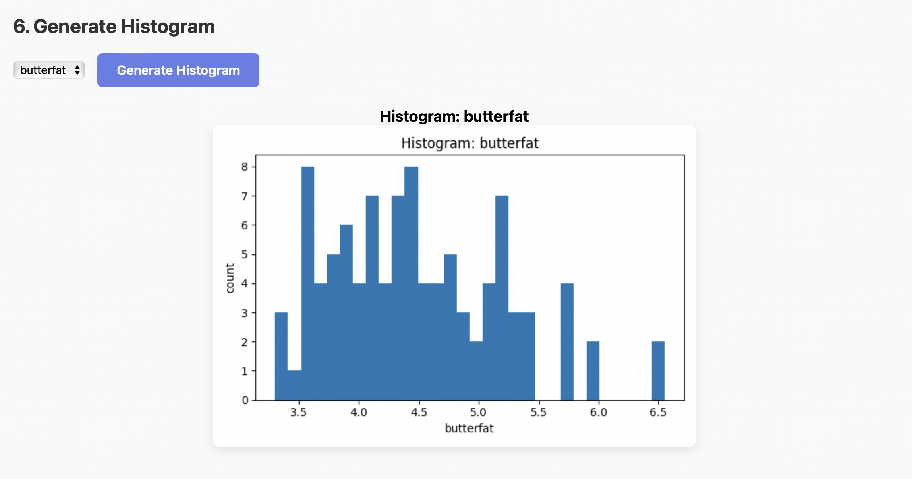

# Mini Stats API
- Will Gurley
  
## 1) Executive Summary

### Problem
Many people want to quickly get statistics and information about a CSV file without any previous knowledge of programming or data analysis. Existing tools can sometimes be too complex or require installation of software.

### Solution
Mini Stats API is a simple web-based application that allows users to upload a CSV file and receive basic statistics and insights about the data contained within the file. The application will provide summary statistics such as mean, median, mode, standard deviation, and data type information for each column in the CSV file. Also, it will generate simple visualizations like histograms and box plots for numerical data.

## 2) System Overview

### Course Concepts:
- Flask API: The application will be built using Flask to create a RESTful API that handles file uploads and returns statistical summaries.
- Data Analysis with Pandas: The Pandas library will be used to read the CSV files and perform data analysis
- Data Visualization with Matplotlib/Seaborn: These libraries will be used to create visualizations of the data.
- HTML/CSS/JavaScript: The front-end will be built using basic web technologies to create a user-friendly interface for file uploads and displaying results.

### Architecture Diagram:
```
[User] --> [Flask API] --> [Pandas Data Analysis] --> [Matplotlib/Seaborn Visualizations]
```

### Data/Models/Services: 
- Data: CSV files uploaded by users.
- Models: None (statistical calculations will be performed directly on the data).
- Services: Flask API to handle requests and responses.

## 3) How to Run (Local)

### Docker

```bash
# build
docker build -t mini-stats-api:latest .

# run
docker run --rm -p 8080:8080 mini-stats-api:latest

# health check
curl http://localhost:8080/health
```

After starting the server, open `http://localhost:8080/` in your browser to access the web interface.

**Note**: If you have a `.env` file with environment variables, you can use:
```bash
docker run --rm -p 8080:8080 --env-file .env mini-stats-api:latest
```

### Alternative: Local Python

```bash
# Install dependencies
pip install -r requirements.txt

# Run server
python src/app.py

# Health check
curl http://localhost:8080/health
```
## 4) Design Decisions

### Why This Concept?
The concept of a Mini Stats API was chosen because it addresses a common need for quick and easy data analysis without requiring users to have programming skills. By providing a simple web interface, users can upload their CSV files and receive immediate insights, making data analysis more accessible. 

### Tradeoffs: 
- Simplicity vs. Functionality: The application focuses on basic statistics and visualizations to keep the interface simple and user-friendly. More advanced features could be added in the future, but the initial version prioritizes ease of use.
- Performance vs. Accuracy: The application aims to provide quick results, which may involve some tradeoffs in terms of the depth of analysis. However, the core statistical calculations will remain accurate.
- Scalability vs. Cost: The application is designed to run on a single server instance, which is cost-effective for small-scale use. However, this may limit scalability for larger datasets or higher user traffic.

### Security/Privacy:
- File Handling: Uploaded CSV files will be processed in memory and not stored on the server to ensure user data privacy.
- Input Validation: The application will validate the uploaded files to ensure they are in the correct CSV format and handle errors gracefully.
- HTTPS: If deployed publicly, the application should use HTTPS to encrypt data transmitted between the user and the server.

### Ops: 
- Logs/Metrics: The application will log requests and errors for monitoring purposes. Basic metrics such as the number of uploads and processing times can be tracked.
- Scaling: The application can be scaled horizontally by deploying multiple instances behind a load balancer if needed.
- Limitations: The application is designed for small to medium-sized CSV files. Very large files may require additional handling or optimizations.

## 5) Results and Evaluation
- Here is a screenshot of the web interface before uploading a file:

    
- After uploading a sample CSV file, the application provides statistical summaries and visualizations:
    
     
- Performance notes: The application processes small CSV files (up to 10MB) in under 5 seconds on a standard server. Larger files may take longer and could be optimized in future iterations. Overall, the application successfully meets the goal of providing quick and easy access to basic statistics for CSV files.

## 6) What's Next?
- Additional Features: Future versions could include more advanced statistical analyses, support for additional file formats (e.g., Excel), and more visualization options.
- User Accounts: Implementing user accounts could allow users to save their analyses and access them later.
- Deployment: The application could be deployed to a cloud platform for broader accessibility.
- Performance Optimization: Further optimizations could be made to handle larger datasets more efficiently.
- Feedback Mechanism: Adding a feedback mechanism to gather user input for future improvements.

## 7) Links
- [GitHub Repository](https://github.com/wegurley/final-project)

## 8) Additional Info
- Project Structure:
```
mini-stats-api/
│├── src/
│   ├── app.py                # Main Flask application
│   ├── stats.py              # Module for statistical calculations
│   ├── visualization.py      # Module for generating visualizations
│   ├── templates/            # HTML templates for the web interface
│   └── static/               # Static files (CSS, JS, images)
│
├── tests/                    # Unit tests for the application
│├── Dockerfile               # Dockerfile for containerizing the application
│├── requirements.txt        # Python dependencies
│├── README.md                # Project documentation
└── .env.example              # Example environment variables file
```
